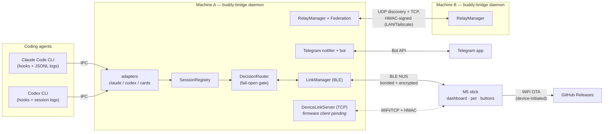

# Architecture

How the pieces fit: a C++ firmware on the stick, a Python bridge on each
computer, a newline-JSON protocol between them, and optional layers
(federation, Telegram, OTA) on top. This page names the actual files and
components; the wire format itself lives in [REFERENCE.md](../REFERENCE.md)
(v1) and [PROTOCOL_V2.md](../PROTOCOL_V2.md) (v2).

## The big picture



One bridge at a time holds the stick's BLE link (the **holder**). Other
machines federate their sessions to it; approvals made on the stick route
back to whichever machine asked. Telegram is a second, phone-shaped stick.

---

## Firmware (`src/`)

### Layering

```
main.cpp                 loop, screens, overlays, gestures, persona
  │
  ├── proto_parse.h      transport-agnostic protocol core (native-testable)
  │     ├── data.h       feeders: USB serial + BLE ring → per-transport ProtoState
  │     ├── session_table.h   sid-keyed session list (order-preserving, pin-safe)
  │     └── host_registry.*   7-slot bonded-host registry + soft-pin policy
  ├── ble_bridge.*       Bluedroid NUS service, pairing gate, bond plumbing
  ├── hal/               namespace board:: — the only place hardware differs
  ├── logic/             pure headers (no Arduino deps) + native unit tests
  ├── stats.h            NVS settings/stats + sv schema migrations
  ├── wifi_store.*       multi-network credential list on LittleFS
  ├── ota/               WiFi OTA from GitHub releases (BUDDY_OTA builds)
  ├── audio/             motif player + tune engine (BUDDY_EXTRAS_FULL)
  ├── ir/                RMT learn/replay remote (BUDDY_EXTRAS_FULL)
  └── buddies/ buddy.* character.*   ASCII species + GIF pets
```

### The HAL seam — `namespace board` ([`src/hal/hal.h`](../src/hal/hal.h))

All boards run M5Unified; the seam isolates what genuinely differs — PMIC
(M5PM1 vs AXP192 vs AXP2101), RTC (BM8563 vs a millis-projected software
clock on the RTC-less StickS3), LED, power-button gestures, battery
telemetry. Shared paths live in `hal_common.cpp`; each backend
(`hal_sticks3.cpp`, `hal_stickc_plus.cpp`, `hal_stickc_plus2.cpp`) is
guarded by its `BOARD_*` env flag. `src/compat.h` carries pure type shims
only. Porting to a new board means one backend file — the port spec for
the e-ink targets ([PORT_SPEC.md](PORT_SPEC.md)) is written against
exactly this seam.

### Screens and input

`enum DisplayMode { DISP_DASH, DISP_NORMAL, DISP_SESSIONS, DISP_PET,
DISP_CLOCK, DISP_CARDS, DISP_INFO }` is the **A**-press carousel
(`src/main.cpp`); `DISP_EXTRAS` (pomodoro, IR) parks outside it under
`menu > extras`.

- **DASH** — waiting-count header, one color-coded row per session
  (amber = waiting, green = running, blue = done), transcript ticker.
- **NORMAL** — the pet, host badge, per-session state pips.
- **SESSIONS** — paginated detail: agent badge, title, tokens, last line.
- **CLOCK / CARDS / INFO** — clock faces, `ntfy` card reader, reference
  pages (hosts, sounds legend, buttons, device stats).

Overlays outrank screens: the **approval prompt** preempts everything
(**A** = allow once, **B** = deny), then the pairing passkey, then
read-only asks. Button handling is swallowed while a passkey is up, and
there is deliberately no gesture that can answer a prompt — gestures
(flip-to-switch-host, double-tap-wake, shake, face-down nap) only ever
navigate or wake ([`src/logic/gesture_logic.h`](../src/logic/gesture_logic.h)).

### Protocol state, hard rules

`proto_parse.h` owns parsing for both transports, each with its own
negotiated state (`_usbProto`, `_btProto`). The invariants everything else
is built around:

1. **Pre-hello v1 purity** — until a host completes the v2 `hello`
   handshake, the device is byte-identical to v1 firmware. v2 commands
   fall into v1's unknown-command swallow; no v2 bytes are ever emitted
   first.
2. **Encrypted-link posture** — the NUS characteristics require an
   encrypted (bonded) link in both pairing modes (passkey default,
   just-works opt-in). Secrets (WiFi passwords, device-link tokens) ride
   only that encrypted BLE pipe, never the plaintext TCP link.
3. **NVS `sv` schema** — settings/stats migrate forward via a versioned
   one-shot migration (`nvsMigrate()`), so an OTA never silently zeroes a
   device's history.

### Native tests

Everything in `src/logic/`, plus the session table, host registry, and
parse core, compiles on the host (`pio test -e native`, Unity, 18 suites
under [`test/`](../test)) — gesture edge cases, pairing-gate truth tables,
protocol golden lines, wrap/UTF-8 hardening, motif scheduling, OTA URL
parsing. CI runs them on every push; a serial conformance harness
([`tools/test_protocol.py`](../tools/test_protocol.py)) drives a live
stick end-to-end.

---

## Host bridge (`host/src/buddy_bridge/`)

A single asyncio daemon per machine. Usage documentation lives in
[host/README.md](../host/README.md); this is the component map.

| Component | File(s) | Job |
|---|---|---|
| `Daemon` | `daemon.py` | Supervisor: heartbeat pump, gate flow, card drain, transport arbitration |
| CLI | `cli.py` | `daemon · status · pair · mode · hooks · service · setup · doctor · wifi · link-provision · telegram …` |
| IPC | `ipc/` | Loopback socket + `endpoint.json` discovery, token-authed; hooks use a fire-and-forget sync client |
| BLE link | `ble/link.py` | `LinkManager`: scan/backoff/reconnect, MTU-safe chunking, notify reassembly; `winrt_radio.py` power-cycles a wedged Windows radio |
| Device link | `link_tcp.py` | `DeviceLinkServer`: HMAC-authenticated TCP listener the stick can dial over LAN instead of BLE (host side shipped; firmware client pending). BLE pauses while a TCP link is up |
| Protocol | `protocol.py` | v1 snapshot + v2 frame composers with byte-budget cascades; `HelloAck` parsing |
| Sessions | `registry.py` | `(agent, session_id)`-keyed state: run/wait/idle, waiting-FIFO, entries feed |
| Gate | `decision.py`, `matchers.py`, `audit.py` | `DecisionRouter` maps wire ids to pending futures; `matchers.toml` auto-allow/always-ask; append-only `audit.jsonl` with decision source (`device`, `telegram`, `auto_allow`, `timeout_fallback`…) |
| Adapters | `adapters/` | Claude hooks + JSONL tailer, Codex hooks + session scanner, GitHub/weather/update card pollers |
| Cards | `cards.py` | `ntfy` pipeline: budget composer, content dedupe with TTL, bounded queue |
| Federation | `relay.py`, `federation.py` | `RelayManager` (HMAC-signed UDP discovery + TCP events, static peers for Tailscale) and `Federation` (per-peer TTL state, `r<k>:`-namespaced sids, merged waiting-first view, decision relay home) |
| Telegram | `notify/telegram.py`, `notify/telegram_bot.py` | Push notifier (dedupe, rate limits, mute) + long-poll bot: `/sessions /status /pending`, inline Allow/Deny, `AskUserQuestion` keyboards |
| Hooks | `hooks/claude_hook.py`, `hooks/codex_hook.py` | The actual processes Claude Code / Codex spawn; stdlib-only, exit 0 on every path |
| Installers | `install/` | Managed merges into Claude `settings.json` / Codex `hooks.json` — marker-scoped, foreign entries preserved |
| Usage | `usage.py` | Token ledger: lifetime + local-midnight daily totals, cumulative-counter re-baselining |

### The permission gate, end to end

The flow that justifies the hardware:

1. Claude Code fires `PreToolUse`; `claude_hook.py` sends the request over
   IPC and blocks (Codex: `PermissionRequest` via `codex_hook.py`).
2. `Daemon` consults `matchers.py` — safe tools skip, `auto_allow` answers
   instantly (audited), everything else becomes a `PendingDecision` with a
   future and a deadline.
3. The next snapshot carries the prompt (tool + one-line hint). The stick
   renders the approval overlay; Telegram gets its buttons.
4. A button press comes back as `{"cmd":"permission","id","decision"}` —
   from the stick, a federated peer's stick, or a Telegram tap — and
   resolves the future. The hook prints an allow/deny decision.
5. **Any other outcome — timeout, BLE drop, daemon down, unmatched tool —
   prints nothing, and the CLI's native prompt proceeds.** Fail-open is
   the contract everywhere; the buddy adds a fast path, never a lock.

Deny reaches the agent as an explicit instruction: *"User denied on
Hardware Buddy device. Do not retry with alternative phrasings."*

### Federation in one paragraph

Every bridge signs UDP announcements with a shared token
(HMAC-SHA256 + freshness window); whoever holds the stick becomes the
**holder**. Non-holders stream `state_sync` snapshots to it over TCP, the
holder merges all machines' sessions into the stick's heartbeat
(`[NAME]`-prefixed titles, `r<k>:`-namespaced ids, oldest prompt first),
and a stick answer for a remote id relays back to its origin — which keeps
its own deadline and fails open regardless. Idle holders can yield the
stick (`idle_yield_min`), so the buddy migrates to whichever machine is
busy. No broadcast domain (Tailscale/WireGuard)? List peers statically.
Nothing binds a socket unless relay is enabled *and* a token is set — the
test suite asserts zero sockets otherwise.

---

## Release pipeline

- **CI** ([`.github/workflows/ci.yml`](../.github/workflows/ci.yml)) —
  builds all four firmware envs (`m5stick-s3`, `m5stick-s3-ota`,
  `m5stickc-plus`, `m5stickc-plus2`), runs the native suites, guards the
  app image at 88% of its partition, and runs the ~500-test host suite on
  Windows/Ubuntu/macOS.
- **Release** (`release.yml`) — on a `v*` tag: builds the OTA-capable env
  with the version stamped from the tag, merges
  bootloader + partitions + app into a single web-flashable image, and
  publishes it alongside app-only binaries and a flasher manifest.
- **Pages** (`pages.yml`) — deploys the
  [web installer](https://arikyeo.github.io/sticks3-buddy/) (`web/`,
  ESP Web Tools), pinned to `releases/latest` so it needs no rebuild per
  release.
- **OTA** — the device itself fetches
  `releases/latest/download/firmware.bin` with redirects disabled and
  reads the version from the `Location` header — no GitHub API, no rate
  limit — then flashes the inactive slot; the bootloader rolls back unless
  the new image marks itself healthy within 15 s.
